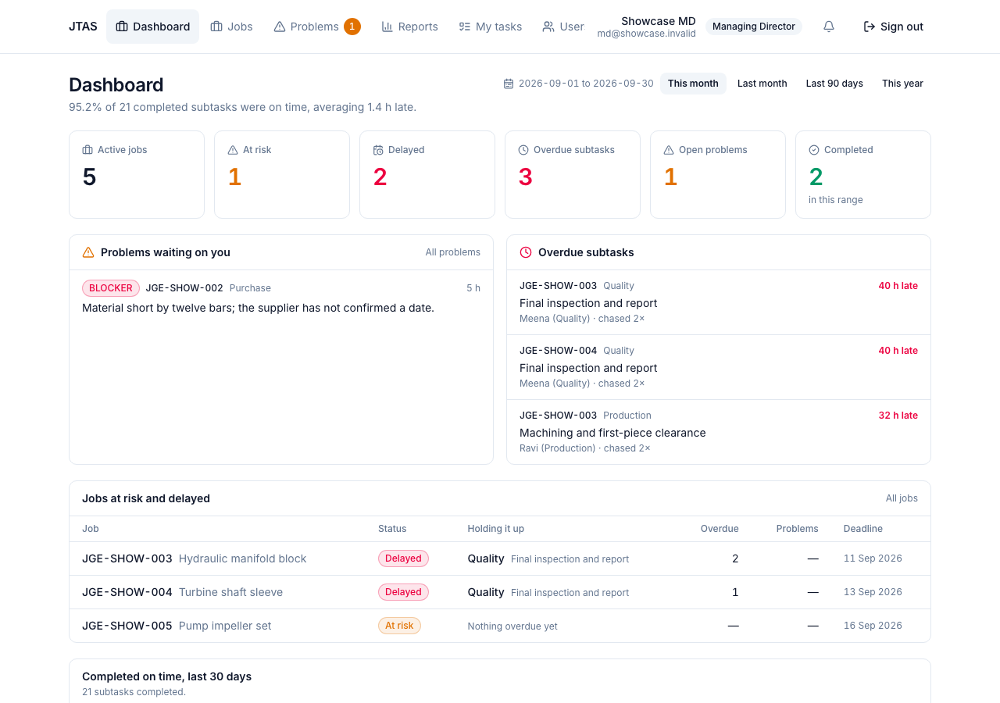
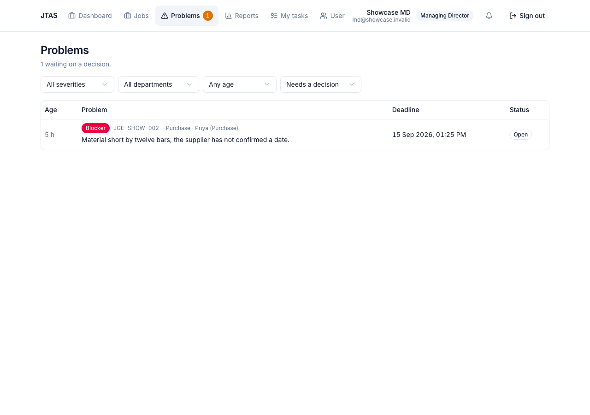

# JTAS — the MD's guide

Everything the Managing Director does in JTAS, in the order you will need it.

**Contents**

- [The dashboard](#the-dashboard)
- [Creating a job](#creating-a-job)
- [Handling a problem](#handling-a-problem)
- [The problem inbox](#the-problem-inbox)
- [People](#people)
- [Reminders and escalation](#reminders-and-escalation)
- [Reports](#reports)
- [What the system emails, and to whom](#what-the-system-emails-and-to-whom)

---

## The dashboard

The line under the heading is the number to watch: *what fraction of finished
work landed on or before its deadline*, over the range chosen on the right. The
range defaults to this month; **Last 90 days** is the more honest view early in
a month.

The six tiles, left to right:

| Tile | What it counts |
| --- | --- |
| **Active jobs** | published and not yet finished or cancelled |
| **At risk** | on course to miss the deadline |
| **Delayed** | already past it |
| **Overdue subtasks** | individual pieces of late work, across all jobs |
| **Open problems** | reported and not yet decided — with how many are over a day old |
| **Completed** | finished inside the range |

Below, three panels:

- **Problems waiting on you** — oldest and most severe first. Anything over a
  day old is flagged; that is the one number this product exists to keep at
  zero.
- **Overdue subtasks** — who has it, how late, and how many times they have
  been chased.
- **Jobs at risk and delayed** — with the department *holding it up*, so you
  know who to ring rather than which job to worry about.

---

## Creating a job

**Jobs → New job.** Three steps.

### 1. Details

Only the title and the overall deadline are required; everything else can be
filled in while the job is still a draft. The job code is allocated by the
system, in sequence, per year — you do not choose it.

The deadline is a date and a time, in IST. Times are stored in UTC and shown in
IST everywhere, so a deadline set at 6 PM is 6 PM to everyone who reads it.

Saving creates a **draft**. Nobody is notified.

### 2. Subtasks

**Apply "Standard CNC job"** lays out the five-step chain — Planning, Purchase,
Store, Production, Quality — each waiting on the one before, with deadlines
worked back from the job's own. Each step is assigned to the first active member
of its department; change any of them.

Every row needs an owner and a deadline. That is what the system chases; a row
without one cannot be published.

**Depends on** is the important column. A step that waits for another starts
**Blocked** and becomes actionable by itself the moment its predecessor is
finished. Nobody has to tell it.

### 3. Review, then publish

The review screen is what publishing will start. If any subtask runs past the
job's own deadline it says so and asks why — the reason goes on the record,
against the job, permanently.

**Publish job** is the point of no return in the sense that matters: every
assignee is emailed, and the first step becomes actionable. Until then, the job
is invisible to everyone but you.

---

## Handling a problem

A member reports a problem from their phone. You get an email and it appears in
the inbox. The subtask stops being chased while it sits with you — which is why
leaving it there is the one thing not to do.

Click the row. Read what they wrote. **Mark as seen** tells them you have it —
the panel stays open so you can decide in the same breath.

Then **Resolve it** and choose one of five outcomes. You are choosing what
happens to the work, not what happens to the record:

| Choice | What it does |
| --- | --- |
| **Carry on** | the blockage is cleared; nothing else changes |
| **Give more time** | move the deadline and resume the work |
| **Give it to someone else** | hand the task to another person |
| **Another department must act** | create a task for them, and make this one wait for it |
| **Call it off** | cancel the task — nothing is deleted |

**What you decided** is required on every path. A resolution with no reason is
indistinguishable from ignoring the problem when somebody reads it back in a
year — and the member sees this text.

If the problem is not a real one, **Not a problem** sends it back with your
explanation. Say why. A bare rejection teaches people to stop reporting, and
then you find out about the material shortage on the delivery date.

### What happens next

The subtask returns to the member's list, in progress, with whatever you
changed. They are emailed. If you extended the deadline, the old one is kept —
**Give more time** writes a record of what it was, what it became and why.

---

## The problem inbox

**Problems** in the top bar; the badge is the number open.

Sorted by severity, then by age. A **Blocker** means the member can do nothing
at all until you act, so it sits at the top. Anything older than a day is
shaded — that is your service level, not the system's.

---

## People

**Users.** Add somebody with their name, email, role and department.

- **MD** sees everything, creates jobs, decides problems, changes settings.
- **Member** sees their own tasks and their department's work.
- **Admin** manages people and settings but does not run jobs.

Adding a user produces a one-time temporary password, shown **once**. Hand it
over; they must change it at first sign-in. If it is lost, reset it from the
same screen.

Nobody is ever deleted. Somebody who leaves is made **inactive**: they cannot
sign in, they stop receiving mail, and every job they touched still shows who
did what. Reassign their open work first — the screen tells you how much there
is.

---

## Reminders and escalation

**Settings.** The defaults are sensible; these are the ones worth understanding.

### Reminders and escalation

| Setting | What it does |
| --- | --- |
| **Default reminder lead time** | how long before a deadline the reminder goes out, unless a subtask overrides it |
| **Escalation interval** | how long to wait before chasing an overdue subtask again |
| **Maximum escalations** | how many times one subtask is chased before the system stops |

The maximum matters more than it looks. Unbounded chasing trains people to
filter JTAS mail, and then the escalation that mattered is filtered too.

### Working hours

Reminders and assignment mails are held until the next working slot; **overdue
mail is not held**, because a missed deadline does not wait for Monday.

Set the shop's start, end and working days. **Hold reminders outside working
hours** is what turns the whole mechanism on and off.

### Email

The **From address**, and **Extra MD recipients** — additional addresses copied
on escalations and the daily digest, for a partner or a works manager.

The SMTP fields override the server's environment variables. Leave them blank to
use what the server was configured with. The password is stored and never shown
again.

> If mail stops, this is the first place to look, and the usual cause: a value
> set here silently overrides a corrected environment variable. See
> [RUNBOOK.md](RUNBOOK.md#triage-mails-are-not-going-out).

### Daily digest

When your morning summary is sent: overdue work, today's deadlines, open
problems. One mail instead of forty.

---

## Reports

**Reports.** A job report as PDF or Excel — the full chain, who had each step,
when it was finished, every problem and every deadline change.

This is what goes to a customer asking why a delivery slipped, and it is
assembled from the record rather than from memory.

---

## What the system emails, and to whom

| Event | Who gets it |
| --- | --- |
| A job is published | each assignee, for their own subtask |
| A subtask becomes actionable | its assignee |
| Deadline approaching | the assignee |
| Deadline passed | the assignee, **and you** |
| Still overdue | you again, up to the maximum |
| A problem is raised | you |
| A problem is decided | the member who raised it |
| A deadline is changed | the assignee |
| More time is asked for | you |
| A job is completed | you |
| Every morning | you — the digest |

Nobody is emailed about a draft. That is what drafts are for.
