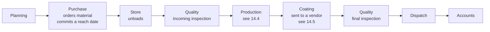
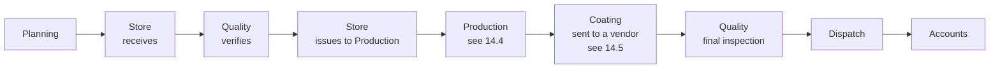
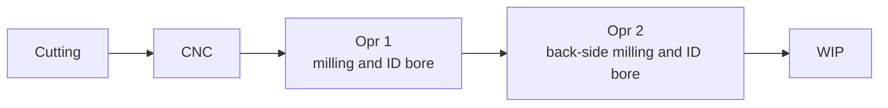
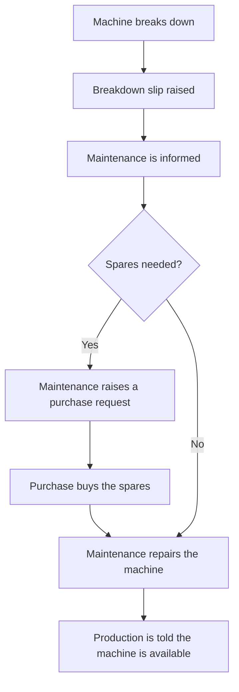

# Product Design Document (PDD)
## Jaraa Task & Accountability System (JTAS)
**Client:** Jaraa Global Engineering Pvt Ltd
**Document version:** 1.1
**Date:** 4 October 2026
**Owner:** Product / Engineering
**Status:** Sections 1–13 are the Phase 1 contract. Section 14 is a draft for the MD to confirm before any of it is built.

---

## 1. Purpose of this document

The PDD defines *what* the product is, who uses it, and what it must do. It is the
contract between the MD and the build team. The SDD (separate document) defines *how*
it is built.

---

## 2. Problem statement

Jaraa Global Engineering runs CNC job orders that pass through eight functions:
Planning, Purchase, Production, HR, Accounts, Store, Quality and Dispatch. Today the
MD tracks progress through phone calls, WhatsApp messages and verbal updates. The
consequences:

- The MD has no single view of where a job actually stands.
- Delays surface only after the customer complains.
- Problems (material short, tool broken, drawing mismatch) reach the MD late, when the
  cost of recovery is highest.
- There is no record of who was told what, and when, so accountability is disputed.

## 3. Product vision

One web application where the MD issues a CNC job, breaks it into department
subtasks with deadlines, and the system chases everybody automatically. Nobody has to
remember a deadline, and nothing silently slips. Every problem is raised in writing,
lands on the MD's desk immediately, and is closed with a recorded decision.

**One-line pitch:** *Assign it once, and the system does the following up.*

---

## 4. Users and personas

| Persona | Role in system | Count | Primary need |
|---|---|---|---|
| **Managing Director** | `MD` (super admin) | 1 | See everything, decide fast, prove accountability |
| **Department Member** | `MEMBER` | 8–20 | Know exactly what is due today and report status in 10 seconds |
| **Deputy / Coordinator** | `DEPUTY_MD` (optional) | 0–2 | Act for the MD when he is travelling |
| **System Admin** | `ADMIN` | 1 | Create users, reset passwords, maintain holiday calendar |

The eight departments are seeded as: Planning, Purchase, Store, Production, Quality,
Dispatch, Accounts, HR.

> **Improvement added (I-01):** a `DEPUTY_MD` role. With a single-MD design, the whole
> factory stalls whenever the MD is on a flight or in a customer meeting. The deputy
> can approve problems and extend deadlines; every deputy action is stamped
> "on behalf of MD" in the audit log.

---

## 5. Scope

### 5.1 In scope (Phase 1)
1. Separate login per user, role-based screens, no public self-signup.
2. MD creates a **Job** (CNC product order) with an overall deadline.
3. MD creates **Subtasks** under the job, one or more per department, each with its
   own assignee and its own deadline.
4. **Reminder** notification a configurable lead time before each subtask deadline
   (default 6 hours; the 6 PM / 12 PM example is exactly this default).
5. Member marks a subtask **Completed**, or selects **Problem** and describes it in a
   free-text box.
6. **Overdue escalation:** if a deadline passes and the subtask is neither completed
   nor flagged as a problem, an automated email goes to
   - the MD: *"<Member> has not completed <subtask> of <job>, due <time>"*
   - the member: *"Please complete the work — <subtask> of <job> was due <time>"*
7. MD **Problem inbox**: acknowledge, add an action note, extend the deadline,
   reassign, or cancel.
8. Job and department dashboards, overdue list, on-time percentage.
9. Full audit trail of every status change and deadline change.
10. Mobile-friendly responsive UI (usable on a phone on the shop floor).

### 5.2 Out of scope (Phase 1)
- ERP / Tally / accounting integration.
- Machine-level OEE or CNC controller data capture.
- Customer-facing portal.
- Payroll, attendance, leave (HR here means HR *tasks* on a job, not HR software).
- Inventory quantity management (Store here means Store *tasks*, not stock ledger).
- Native Android/iOS apps (PWA install is offered instead).

---

## 6. Core concepts

```
Job (one CNC order)
 └── Subtask (one department's piece of work)   ── has deadline, assignee, status
      ├── Problem (raised by member, resolved by MD)
      ├── Comments (thread)
      └── Attachments (drawing, PO, inspection report)
```

### 6.1 Default CNC job flow

Subtasks may depend on each other. The seeded template encodes the real shop
sequence, and the MD can override any of it:

```
Planning ──► Purchase ──► Store ──► Production ──► Quality ──► Dispatch ──► Accounts (invoice)
   │
   └──► HR (manpower / shift allocation, runs in parallel)
```

> **Improvement added (I-02): subtask dependencies.** A Production subtask that starts
> before material is in the Store is a fake deadline. A dependent subtask sits in
> `BLOCKED` and its clock is not enforced until its predecessor is completed. It also
> means the MD instantly sees the *root* delay instead of six red rows.

> **Improvement added (I-03): job templates.** Creating eight subtasks by hand for
> every order will not survive contact with a busy MD. A template stores the eight
> standard subtasks with day/hour offsets from the job deadline, so a new job is
> "pick template → set due date → review → publish" in under a minute.

> **4 October 2026.** The MD described two material routes, split production
> operations, coating sent to a vendor, and a maintenance flow that is not part
> of a job. That proposal is **section 14**. The diagram above remains the live
> template until he confirms section 14.

---

## 7. Functional requirements

### 7.1 Authentication and access
| ID | Requirement | Priority |
|---|---|---|
| FR-01 | Email + password login, separate credentials per user. | Must |
| FR-02 | No self-registration. MD/Admin creates users and assigns department + role. | Must |
| FR-03 | Forced password change on first login; password reset by Admin. | Must |
| FR-04 | Session expiry after 12 hours idle; "remember this device" for 30 days. | Should |
| FR-05 | A member sees only jobs where he has at least one subtask. MD/Deputy see all. | Must |
| FR-06 | Account lockout for 15 minutes after 5 failed attempts. | Should |

### 7.2 Job management (MD)
| ID | Requirement | Priority |
|---|---|---|
| FR-10 | Create a job with: auto job code (`JGE-2026-0001`), title, customer, part number, drawing number, quantity, priority, overall deadline, description, attachments. | Must |
| FR-11 | Create a job from a template, auto-generating department subtasks with offset deadlines. | Should |
| FR-12 | Edit job while in `DRAFT`; after `PUBLISHED`, changes to deadlines are logged and notified. | Must |
| FR-13 | Job status derived automatically: `DRAFT`, `IN_PROGRESS`, `AT_RISK`, `DELAYED`, `COMPLETED`, `CANCELLED`. | Must |
| FR-14 | Cancel or put a job on hold; all its subtask timers pause. | Should |

### 7.3 Subtask assignment
| ID | Requirement | Priority |
|---|---|---|
| FR-20 | One subtask = one department + one assignee + one deadline (date **and** time). | Must |
| FR-21 | Per-subtask reminder lead time in hours, default from settings (6 h). | Must |
| FR-22 | Optional dependency on another subtask of the same job. | Should |
| FR-23 | Subtask deadline cannot exceed the job's overall deadline; system warns, MD may override with a reason. | Should |
| FR-24 | MD can reassign a subtask; both old and new assignee are notified. | Must |
| FR-25 | Optional `requires_approval` flag: member's "Completed" becomes `AWAITING_APPROVAL` until MD accepts. | Could |

> **Improvement added (I-04): optional completion approval.** Self-declared
> "completed" is the weakest link in this kind of system. The flag is off by default
> so it does not create bureaucracy, and is switched on for the subtasks that matter
> (Quality clearance, Dispatch).

### 7.4 Member workspace
| ID | Requirement | Priority |
|---|---|---|
| FR-30 | "My Tasks" screen grouped: Overdue, Due today, Due this week, Blocked, Done. | Must |
| FR-31 | Mark **In Progress**, **Completed**, or **Problem**. | Must |
| FR-32 | Raising a problem requires a description of at least 20 characters and a severity (Low / Medium / High / Blocker). | Must |
| FR-33 | Member may request a deadline extension with a reason; only MD can grant it. | Should |
| FR-34 | Member can comment and attach files on his own subtasks. | Should |
| FR-35 | Member cannot edit his own deadline, cannot delete a subtask, cannot un-complete after MD approval. | Must |

### 7.5 Problem handling
| ID | Requirement | Priority |
|---|---|---|
| FR-40 | On problem raise: instant email + in-app notification to MD (and Deputy). | Must |
| FR-41 | MD problem inbox with age, severity, job, department. | Must |
| FR-42 | MD actions: Acknowledge, add action note, Extend deadline, Reassign, Escalate to another department, Resolve, Cancel subtask. | Must |
| FR-43 | Member is notified of the MD's decision; subtask returns to `IN_PROGRESS` on resolution. | Must |
| FR-44 | A subtask in `PROBLEM` does not fire overdue mails to the member, but fires a daily "unresolved problem" nudge to the MD. | Should |

> **Improvement added (I-05).** In the original brief, a member who has reported a
> genuine blocker would keep receiving "please complete the work" mails — which
> teaches everyone to ignore the mails. Once a problem is on record, the pressure
> correctly moves to the MD.

### 7.6 Notifications
| ID | Requirement | Priority |
|---|---|---|
| FR-50 | `SUBTASK_ASSIGNED` → member, immediately on publish. | Must |
| FR-51 | `DEADLINE_REMINDER` → member, at `deadline − lead_time`. | Must |
| FR-52 | `OVERDUE_MEMBER` → member: "Please complete the work". | Must |
| FR-53 | `OVERDUE_MD` → MD: "<Member> did not complete...". | Must |
| FR-54 | Repeat escalation every 4 hours after the deadline, maximum 3 repeats, then stop and mark `ESCALATED`. | Should |
| FR-55 | `PROBLEM_RAISED` → MD; `PROBLEM_RESOLVED` → member; `DEADLINE_CHANGED` → assignee. | Must |
| FR-56 | Daily 9:00 AM IST digest to MD: overdue, due today, open problems. | Should |
| FR-57 | Reminders are suppressed outside working hours and on holidays, and delivered at the next working-hour slot; **overdue mails are never suppressed**. | Should |
| FR-58 | Every notification is recorded once and only once, even if the scheduler restarts. | Must |
| FR-59 | Optional WhatsApp/SMS channel for `OVERDUE_*` and `PROBLEM_RAISED`. | Could |

> **Improvement added (I-06): working-hours-aware reminders and a notification ledger.**
> A 2 AM reminder is noise. A duplicate mail storm after a server restart destroys
> trust in the tool. Both are prevented by design, not by luck.

> **Improvement added (I-07): WhatsApp/SMS option.** On an Indian shop floor, email
> is checked less often than WhatsApp. The channel is pluggable so it can be enabled
> later without touching the rest of the system.

### 7.7 Dashboards and reports
| ID | Requirement | Priority |
|---|---|---|
| FR-60 | MD dashboard: active jobs, at-risk jobs, overdue subtasks, open problems, on-time % this month. | Must |
| FR-61 | Job detail timeline showing every subtask, its state and its delay in hours. | Must |
| FR-62 | Department scorecard: on-time %, average delay, problems raised, problems caused. | Should |
| FR-63 | Export any list to Excel; export a job report to PDF. | Should |
| FR-64 | Date-range filters and full-text search on job code, part number, customer. | Should |

### 7.8 Administration
| ID | Requirement | Priority |
|---|---|---|
| FR-70 | User CRUD, activate/deactivate (never hard-delete). | Must |
| FR-71 | Settings: default reminder lead time, escalation interval and count, working hours, digest time, SMTP details. | Must |
| FR-72 | Holiday calendar maintenance. | Should |
| FR-73 | Immutable audit log, filterable by user, entity and date. | Must |
| FR-74 | Job template management. | Should |

---

## 8. Subtask state machine

```
                    ┌───────────── BLOCKED ◄──── (dependency not complete)
                    │                  │
                    ▼                  ▼
PENDING ──► IN_PROGRESS ──► COMPLETED ──► (job closes)
   │             │   ▲            ▲
   │             ▼   │            │  MD approves
   │         PROBLEM─┘      AWAITING_APPROVAL
   │             │                 │  MD rejects
   │             │                 └──► IN_PROGRESS
   ▼             ▼
CANCELLED    ON_HOLD
```

`OVERDUE` is **not** a state. It is a derived condition (`now > deadline AND status
NOT IN (COMPLETED, CANCELLED)`), so a subtask can be simultaneously
`IN_PROGRESS` and overdue. This keeps the history honest.

> **Improvement added (I-08).** Treating "overdue" as a status would erase the
> information about what the person was actually doing, and would need a reverse
> transition when the deadline is extended.

---

## 9. Non-functional requirements

| Area | Requirement |
|---|---|
| Users | 25 named users, 15 concurrent. Design headroom to 100. |
| Volume | ~50 jobs/month, ~400 subtasks/month, 3 years online = ~15k subtasks. Trivial for Postgres. |
| Performance | Page interactive < 2 s on 4G; list APIs < 500 ms p95. |
| Availability | 99% during 8 AM–10 PM IST. Scheduler must survive restart without double-sending. |
| Timezone | All timestamps stored in UTC, displayed in Asia/Kolkata. |
| Security | Bcrypt (cost 12) passwords, HTTPS only, JWT with refresh rotation, RBAC enforced server-side on every endpoint, file upload type and size validation, rate limiting on auth. |
| Auditability | No hard deletes on jobs, subtasks, problems or users. |
| Backup | Nightly automated DB backup, 30-day retention, documented restore test. |
| Accessibility | Keyboard navigable, minimum 14 px body text, contrast ≥ 4.5:1. |
| Language | English UI in Phase 1; strings externalised for a later Tamil/Hindi pass. |

---

## 10. Success metrics

| Metric | Baseline | Target at 90 days |
|---|---|---|
| Jobs with all subtasks updated in-app | 0% | > 90% |
| Subtasks completed on or before deadline | unknown | > 80% |
| Median time from problem raised to MD action | hours/days | < 2 hours |
| MD phone calls per day chasing status | high | halved (self-reported) |
| Overdue mails per member per week | n/a | trending down month on month |

---

## 11. Release plan

| Phase | Contents | Estimate |
|---|---|---|
| **P1 — Core loop** | Auth, users, departments, jobs, subtasks, member status update, problem raise, MD inbox, email reminder + overdue escalation, basic dashboards, audit log | 4–5 weeks |
| **P2 — Hardening** | Templates, dependencies, working-hours calendar, department scorecards, Excel/PDF export, daily digest, attachments | 2–3 weeks |
| **P3 — Reach** | WhatsApp/SMS, PWA install + push, approval workflow, Deputy MD, local-language strings | 2–3 weeks |

---

## 12. Risks and mitigations

| Risk | Mitigation |
|---|---|
| Members bypass the tool and keep using WhatsApp | Phase 1 must be faster than typing a WhatsApp message: two taps to complete. MD publicly stops accepting verbal status. |
| Mail lands in spam and nobody sees it | Use a real SMTP provider with SPF/DKIM on the jaraa domain; in-app notification as backup; WhatsApp in P3. |
| MD does not clear the problem inbox, and the tool becomes a graveyard | Daily digest with problem age; problems older than 24 h flagged red on the dashboard. |
| Deadlines set unrealistically, everything red, alarm fatigue | Extension-request flow plus department scorecards make bad planning visible rather than hidden. |
| One person leaves and his subtasks are orphaned | Deactivating a user forces reassignment of his open subtasks. |
| Scheduler silently dies, no mails go out | Scheduler writes a heartbeat; a missed heartbeat alerts the admin. |

---

## 13. Open questions for the MD

1. Company email domain and SMTP provider (Google Workspace, Zoho, Microsoft 365)?
2. Working hours and weekly off — 9:00 AM to 6:00 PM, Sunday off? Second Saturday?
3. Should a member see other departments' subtasks on the same job (read-only)? Recommended: yes, it reduces phone calls.
4. Exact overdue mail wording the MD wants, and the signature block.
5. Hosting preference: cloud (recommended) or an in-office server?
6. Is a Deputy MD wanted from day one, and who?
7. Are Accounts and HR subtasks needed on every job, or only on some?

The questions from the 4 October meeting are in section 14.11. They are separate from the list above.

---

## 14. Shop-floor revision — 4 October 2026

**Status: draft for the MD to confirm. Nothing in this section is to be built until he says the reading is right.**

This section records what was said in the client meeting and how it would sit on top of the system already built (sections 1–13). It is the note to take back to him.

**An option, if he would rather see it arrive in pieces.** The full scope below stays the proposal. This is a way to approve the urgent part first.

| Phase | What is built | What he can see at the end | Time |
|---|---|---|---|
| **A** | Commitment dates, with downstream departments notified when a date is set or changed. The two material routes as separate templates. Quality split into incoming inspection and final inspection. | A company-material job and a customer-material job, each with its own chain. Purchase (or Store, on customer material) commits a date, and the later departments are told. Incoming material and finished parts are inspected as two separate tasks. | 2–3 weeks |
| **B** | Production split into Cutting, CNC, Opr 1, Opr 2 and WIP. Quantity completed, accepted, rejected and despatched, rolled up on the job. | Each operation is its own update, and the job header shows ordered, machined, accepted, rejected and despatched. | 3–4 weeks |
| **C** | The Maintenance breakdown flow. | A machine breakdown is raised, Maintenance is told, spares go through Purchase when needed, and Production is told when the machine is back. | After A and B. Estimate in 14.10: 8–12 days. |
| **D** | SMS and WhatsApp for department heads. | Heads get the same events by SMS and WhatsApp as well as email. | Starts only after his DLT registration and WhatsApp business verification are through. |

Phase A is the part he described as most urgent. Phases B, C and D wait on his yes to this reading, and D also waits on his paperwork.

One item from the same conversation is already in the software, because it is small and he asked for it directly: when a department finishes and that unblocks the next task, the next assignee is emailed that they can start. That mail is described in 14.8. It does not depend on confirming the rest of this section.

### 14.1 Two material routes

A job declares how the raw material arrives. The two routes share Planning at the front and Production onwards at the back. They differ in the middle.

**Company material.** Jaraa buys it. Purchase places the order, states a lead time, and the material arrives later.



**Customer material.** The customer sends the material. Uno Minda is a continuous supply; other customers send material for two or three months. There is no Purchase step on this route.



Store appears twice on the customer route: once to receive, once to issue after Quality has verified. Those are two tasks for the same department, which the current product already allows.

HR stays off to the side of both routes, as it does today: manpower and shift allocation, started from Planning, running while the material moves.

The coating box is drawn after Production and before final inspection. He described coating as a vendor step. He did not say where it sits. That position is a proposal, and it is question 6 in 14.11.

### 14.2 Commitment dates

This is the point he spent time on.

The department sets its own date and commits to it. Purchase, for example, says "ordered 1 October, material reaches 8 October". Downstream departments see that date and prepare against it: buying tools, booking machine time. The MD can change the date when he needs to. The department proposes it.

Rules:

| | |
|---|---|
| Who sets it | The department that owns the task. |
| Who can change it | That department, and the MD. An MD change is recorded as his, with a reason, the same way a deadline change is recorded today. |
| What downstream plans against | The commitment date, once it exists. |
| What happens when it is set or changed | Downstream departments are notified **first**, before any other consequence of that change. The date and those notices are one action: the date is not treated as set until the notices are queued. |

"Downstream" here means every later department on the same job, following the arrows in 14.1, so Production can book a machine when Purchase commits a reach date. The next department alone is told when it is their turn to start (14.8). Those are two different messages.

Today the MD (or the template) sets every deadline at publish, and a department cannot propose one. Commitment date is a new field on the task. The template date can remain a suggestion. Whether that suggestion counts as a commitment before the department confirms it is question 2 in 14.11.

### 14.3 Quality appears twice

| Inspection | Question it answers | Where it sits |
|---|---|---|
| Incoming | Is the received raw material what was ordered, and is it in good condition? | After Store unloads (company material) or after Store receives (customer material). |
| Final | Is the finished part acceptable? | After coating, before Dispatch. |

If incoming material is rejected, Quality raises a **problem against the Purchase task**. It does not create a new task. Purchase then takes it up with the supplier. The problem uses the flow already built: a written description, a severity, the MD's inbox, and the Purchase task moving to problem until the MD resolves it.

On customer material there is no Purchase task. Who owns that rejection is question 5 in 14.11.

### 14.4 Production splits into tracked operations

Production is no longer one task. Each operation is its own task, in order:



Each operation is tracked on its own. Completing Cutting is what tells the CNC assignee they can start, and so on down the line.

**Question for the MD.** This means the Production head updates the job several times — once per operation — where today he updates it once. Please confirm that load is acceptable before this is built. It is question 1 in 14.11.

### 14.5 Coating is sent out

Coating is a vendor step with a lead time. It is a wait on an outside party. It is shaped like Purchase (a date we are waiting on, set as a commitment) and unlike Production (nobody in the shop is cutting or machining).

It is a task on the job so the chain waits for it. It is not a new department, and it is not a machine operation. Who is named as the assignee — the person who sends the parts out and chases the vendor — is question 7 in 14.11.

### 14.6 Maintenance is a new department

Maintenance fixes CNC and VMC machines. A breakdown is its own flow. It is not a task inside a job.



The slip names the machine. It may name the job that was running, so the MD can see why that job is standing, and the job's own chain does not gain a Maintenance task.

"Purchase buys the spares" reuses Purchase as a department. It does not, in this proposal, become a full purchase-order or inventory system. The lightweight shape is: the breakdown carries a spares request, Purchase gets a task to buy them, and closing that task returns the breakdown to Maintenance. A stores ledger for spares is out of this proposal.

### 14.7 Revised department list

| Department | Change |
|---|---|
| Planning | Unchanged. Stays at the front of both material routes, subject to question 3. |
| Purchase | Unchanged as a department. Absent from the customer-material route. Also buys spares on a breakdown. |
| Store | Unchanged as a department. On customer material it has two tasks: receive, then issue. |
| Production | Unchanged as a department. Its work on a job becomes the five operations in 14.4. |
| Quality | Unchanged as a department. Two tasks on a job: incoming, then final. |
| Dispatch | Unchanged. |
| Accounts | Unchanged. Still subject to the open question in section 13. |
| HR | Unchanged. Still parallel, still subject to the open question in section 13. |
| **Maintenance** | **New.** Owns breakdowns. Does not appear on the job template. |

Coating is an external wait on the job (14.5), not a department in this list.

### 14.8 Notification matrix

Channels:

| Person | Phase 1 (now) | Phase 2 (after his approval, and after his paperwork) |
|---|---|---|
| MD | Email only | Email only. He does not get SMS or WhatsApp. |
| Department heads | Email | Email, plus SMS and WhatsApp |

Phase 1 uses the email path already running. SMS and WhatsApp are a later phase. The software already has a slot for those channels; filling it is a small build **after** the paperwork below. The wait is on Jaraa's side.

**Paperwork, so the lead time is visible.** Both of these are registrations in his company's name. Neither is a code change, and neither can be started from the engineering side.

| Channel | What Jaraa has to do | Lead time | Cost |
|---|---|---|---|
| Transactional SMS in India | DLT registration: company documents, a sender id, and approval of each message template. | Typically 1–3 weeks after the documents are submitted. | Registration plus per-SMS charges from the operator. |
| WhatsApp | WhatsApp Business API: Meta business verification, then a provider account. | Verification is in Meta's queue; it is often longer than the SMS registration and it is not on a fixed clock. | Per-message charge. |

Until those are approved, heads receive the same events by email.

| Event | Who is told | Channel | Phase |
|---|---|---|---|
| A task finishes and the next task is unblocked. "You can start." | The assignee of the next task. | Email | **Phase 1. Already built.** |
| A task is created (job published, or a task added). | Downstream departments, so they can see work coming. | Email | Phase 1, after this section is confirmed. |
| A commitment date is set or changed. | Downstream departments **first**. If the MD changed it, the owning department is told as well. The MD is copied by email. | Email to everyone in this row. SMS and WhatsApp to department heads only. | Email in Phase 1 after confirmation. SMS and WhatsApp in Phase 2. |
| Existing mails: assignment, reminder, overdue to the member, problem raised, problem resolved, deadline changed, daily digest. | As already specified in section 7.6. The MD's copies stay email only. | Email | Already live. |

The product has no "department head" flag today. Every user is a member, the MD, a deputy, or the admin. Until heads are named, "tell the department" means tell the assignee of that department's task on the job. Question 8 asks him to name the heads, because SMS and WhatsApp in Phase 2 are for heads, not for every member.

### 14.9 Quantity tracking

He wants, on each job, how many pieces are ready for dispatch, how many were accepted, how many were rejected, from the first step to the last, and a separate update at each step.

**Proposal: quantities on the tasks, added up on the job.** This is a few numbers typed when a task is updated. It is not a stock system and it is not a manufacturing execution system.

| Who types it | Field | On which task |
|---|---|---|
| Production | Quantity completed at this operation | Each operation in 14.4 |
| Quality | Quantity accepted, quantity rejected | Incoming inspection, and final inspection |
| Dispatch | Quantity despatched | Dispatch |

The job header shows:

| Figure | Where it comes from |
|---|---|
| Ordered | The quantity already on the job. |
| Machined | Quantity completed on the last production operation (WIP), so the operations are not added together and counted twice. |
| Accepted | Quantity accepted at **final** inspection. |
| Rejected | Quantity rejected at **final** inspection. Incoming rejection is shown on its own line, because that is raw material, not a finished piece. |
| Despatched | Quantity despatched. |
| Ready for dispatch | Accepted minus despatched. |

Each operation still shows its own completed quantity, so he can see where the batch thinned.

**What this gives him.** A job-level picture, updated when people update their tasks, of ordered, machined, accepted, rejected, despatched, and ready to go, plus the number each step reported.

**What this leaves out, on purpose.** There is no identity for a single piece. There is no record of which bar became which part. A quantity is the number the person entered. The machine does not confirm it. There is no bin, location, heat number, or serial. Rejected pieces do not automatically travel back to an earlier operation; someone would raise that as a problem or a task if rework is required. Store does not gain a stock ledger.

### 14.10 What this changes in the current build

The system live today has one template: Planning → Purchase → Store → Production → Quality → Dispatch → Accounts, with HR in parallel. Production is one task. Quality is one task, and the Store task's title still says the inspection happens inside Store. The MD sets deadlines at publish. A member can raise a problem only on their own task. The job has a single quantity. There is no Maintenance department and no breakdown. Email is the channel that sends; SMS and WhatsApp are named and not connected.

Estimates below are working days for one engineer who already knows this codebase, after he confirms this section. They are ranges, not a quotation. They assume the lightweight readings in this section, not an inventory system, a purchase-order system, or a machine-monitoring system.

| Piece | What has to change | Effort |
|---|---|---|
| "You can start" email | When a task completes, the next assignee is mailed. | Done. |
| Two material routes | A choice on the job, and a second template that skips Purchase and splits Store into receive and issue. | 3–5 days |
| Quality twice, rejection onto Purchase | Two Quality tasks. Allow Quality to raise a problem on the Purchase task, using the existing problem flow. | 3–5 days |
| Five production operations | Five tasks in the template, chained. The engine already supports that. The load on the Production head is the open question. | 1–2 days |
| Commitment dates | A date the department sets, the MD can override, audited. Downstream notified first on every set and every change. This touches the centre of the product, which is why it is the large item. | 6–10 days |
| Coating as a vendor wait | A task kind that is a wait on an outside date, shaped like a commitment, chained into the job. Sensible to build with commitment dates. | 2–4 days |
| Maintenance and breakdowns | A new department and a new record: slip, inform Maintenance, optional spares request that becomes a Purchase task, then tell Production the machine is back. Beside the job, not inside it. | 8–12 days |
| Rest of the Phase 1 notification matrix | Mails for "task created, tell downstream" and "commitment changed, tell downstream first", once heads or assignees are defined. | 4–6 days |
| Quantity rollup | The fields in 14.9, entry on the task update, totals on the job header. | 4–6 days |
| SMS and WhatsApp | Connect the channels that are already named. Starts when DLT templates and WhatsApp business verification are approved. | 5–8 days of build, after his paperwork (1–3 weeks for DLT, plus Meta's verification, which is not on our clock). |

Taken together, after confirmation, the job-side changes (routes, quality, operations, commitments, coating, quantities, and the extra emails) are on the order of **five to seven weeks**. Maintenance is a further **two to two and a half weeks** and can follow the job-side work. SMS and WhatsApp follow his paperwork and can overlap the end of the build. They cannot start ahead of it.

### 14.11 Open questions for the MD

1. **Production updates.** Splitting Production into Cutting, CNC, Opr 1, Opr 2 and WIP means the Production head updates several times on each job, once per operation, instead of once. Is that acceptable?
2. **When a commitment exists.** Does the date suggested by the template count as the commitment until the department changes it, or is there no commitment until the department explicitly sets one?
3. **Planning.** Both routes above still start with Planning, as the current product does. Does he want Planning on every job, on both routes?
4. **Continuous customer supply.** For a customer such as Uno Minda, who sends material continuously, is one job's material received once, or does Store keep receiving against the same job over the two or three months?
5. **Incoming rejection when the customer supplied the material.** There is no Purchase task to hang the problem on. Who takes it up — the customer, Planning, or Store?
6. **Where coating sits.** The diagram places it after WIP and before final inspection. Is that the right place, and is it on every job?
7. **Who chases the coating vendor.** Which person is the assignee of that wait?
8. **Department heads.** Who is the head of each department? Phase 2 SMS and WhatsApp go to heads. Until he names them, Phase 1 email goes to the assignee of the task.
9. **Partial quantities.** Can incoming inspection accept some of a lot and reject the rest, and does Production then run on the accepted quantity?
10. **A breakdown and the job clock.** When a CNC or VMC is down, should the production operation that was using it stop being chased as overdue until Maintenance closes the slip?
11. **Spares.** Is "Maintenance raises a PR, Purchase buys" enough as a task on the breakdown, or does he want a separate purchase-requisition document? This proposal is the task. A requisition register is a larger piece and is not in the estimate above.
12. **Pieces all the way through.** The quantity model is in pieces. If incoming material is bars or kg, does he still want those counts in the same job header, or only the piece counts from Cutting onward?
