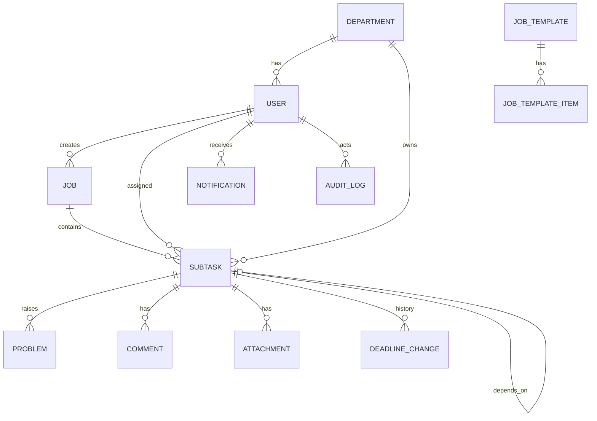

# Software Design Document (SDD)
## Jaraa Task & Accountability System (JTAS)
**Client:** Jaraa Global Engineering Pvt Ltd
**Document version:** 1.0
**Date:** 12 September 2026
**Companion document:** JARAA_PDD_Product_Design_Document.md

---

## 1. Architecture overview

A single deployable Next.js application plus one background worker process, sharing
one PostgreSQL database. At 25 users there is no reason to run microservices; the
design keeps the notification worker separate only because it must run on a clock and
must be restart-safe.

```
 ┌──────────────┐        HTTPS
 │  Browser     │◄────────────────┐
 │  (PWA, React)│                 │
 └──────────────┘                 │
                          ┌───────┴────────────────────────┐
                          │  Next.js App (App Router)      │
                          │  • React Server/Client comps   │
                          │  • /api route handlers         │
                          │  • Auth (JWT in httpOnly cookie)│
                          │  • Service layer (business rules)│
                          └───────┬────────────┬───────────┘
                                  │            │
                         Prisma   │            │ enqueue
                                  ▼            ▼
                        ┌──────────────┐  ┌──────────────┐
                        │ PostgreSQL   │  │ Redis        │
                        │ (system of   │  │ (BullMQ      │
                        │  record)     │  │  queues)     │
                        └──────▲───────┘  └──────▲───────┘
                               │                 │
                        ┌──────┴─────────────────┴───────┐
                        │  Worker process                │
                        │  • scheduler (every 5 min)     │
                        │  • notification dispatcher     │
                        │  • daily digest (cron 09:00)   │
                        └──────┬─────────────────────────┘
                               │
                     ┌─────────┴──────────┬─────────────┐
                     ▼                    ▼             ▼
                  SMTP/SES           WhatsApp API   S3-compatible
                  (email)            (phase 3)      object store
```

### 1.1 Technology choices

| Layer | Choice | Why |
|---|---|---|
| Frontend | Next.js 15 (App Router), React 19, TypeScript | One codebase for UI + API, SSR for fast first paint on 4G |
| Styling | Tailwind CSS + shadcn/ui | Fast, consistent, accessible primitives |
| Forms/validation | react-hook-form + Zod (shared schemas) | One validation definition used on client and server |
| Data fetching | TanStack Query for client mutations, RSC for reads | Simple cache invalidation |
| Backend | Next.js route handlers + a plain service layer | No separate deploy target to maintain |
| ORM | Prisma | Migrations, typed queries |
| Database | PostgreSQL 16 | Transactions, JSONB for audit diffs, real date/time handling |
| Queue/scheduler | BullMQ on Redis | Delayed jobs, retries, dead-letter |
| Email | Nodemailer over company SMTP, or AWS SES / Resend | Deliverability with SPF/DKIM |
| Files | S3-compatible storage (AWS S3 / Cloudflare R2), presigned uploads | App server never handles large bodies |
| Charts | Recharts | Lightweight dashboards |
| Auth | jose (JWT), bcrypt | No third-party dependency for 25 internal users |
| Tests | Vitest (unit), Playwright (e2e) | Deadline logic must be unit-tested |
| Deploy | Docker Compose on a single VPS, or Vercel + Neon + Upstash | Either is fine; Compose keeps cost fixed |
| Logging | pino → file/stdout, plus Sentry for errors | Traceability |

**Minimal-cost alternative** (if Redis is unwanted): replace BullMQ with a
`node-cron` loop in the worker that polls the `notifications` table. The
`dedupe_key` design below makes this safe. Everything else stays the same.

---

## 2. Module decomposition

| # | Module | Responsibility |
|---|---|---|
| M0 | Platform | Repo, config, Docker, migrations, seed, CI |
| M1 | Auth & RBAC | Login, JWT, password policy, guards |
| M2 | Directory | Users, departments, deactivation/reassignment |
| M3 | Jobs | Job CRUD, job code, derived job status, templates |
| M4 | Subtasks | Assignment, deadlines, dependencies, state machine |
| M5 | Member workspace | My Tasks, status updates, extension requests |
| M6 | Problems | Raise, MD inbox, actions, resolution |
| M7 | Notifications | Template rendering, ledger, scheduler, escalation, digest |
| M8 | Analytics | Dashboards, scorecards, exports |
| M9 | Governance | Audit log, settings, holiday calendar |
| M10 | Collaboration | Comments, attachments |
| M11 | Quality & Ops | Tests, seed data, backup, runbook |

---

## 3. Data model

### 3.1 ER diagram



### 3.2 Enumerations

```ts
Role            = 'MD' | 'DEPUTY_MD' | 'ADMIN' | 'MEMBER'
JobStatus       = 'DRAFT' | 'IN_PROGRESS' | 'AT_RISK' | 'DELAYED'
                | 'ON_HOLD' | 'COMPLETED' | 'CANCELLED'
Priority        = 'LOW' | 'NORMAL' | 'HIGH' | 'URGENT'
SubtaskStatus   = 'PENDING' | 'BLOCKED' | 'IN_PROGRESS' | 'PROBLEM'
                | 'AWAITING_APPROVAL' | 'COMPLETED' | 'ON_HOLD' | 'CANCELLED'
ProblemSeverity = 'LOW' | 'MEDIUM' | 'HIGH' | 'BLOCKER'
ProblemStatus   = 'OPEN' | 'ACKNOWLEDGED' | 'RESOLVED' | 'REJECTED'
NotifType       = 'SUBTASK_ASSIGNED' | 'SUBTASK_REASSIGNED' | 'DEADLINE_REMINDER'
                | 'OVERDUE_MEMBER' | 'OVERDUE_MD' | 'PROBLEM_RAISED'
                | 'PROBLEM_RESOLVED' | 'DEADLINE_CHANGED' | 'EXTENSION_REQUESTED'
                | 'APPROVAL_REQUIRED' | 'JOB_COMPLETED' | 'DAILY_DIGEST_MD'
NotifChannel    = 'EMAIL' | 'IN_APP' | 'WHATSAPP' | 'SMS'
NotifStatus     = 'PENDING' | 'SENT' | 'FAILED' | 'SUPPRESSED'
```

### 3.3 Prisma schema (authoritative)

```prisma
model Department {
  id            String    @id @default(cuid())
  code          String    @unique          // PLANNING, PURCHASE, ...
  name          String
  sequenceOrder Int                        // 1..8, the default CNC flow order
  isActive      Boolean   @default(true)
  users         User[]
  subtasks      Subtask[]
}

model User {
  id                 String     @id @default(cuid())
  name               String
  email              String     @unique
  phone              String?
  passwordHash       String
  role               Role
  departmentId       String?
  department         Department? @relation(fields: [departmentId], references: [id])
  isActive           Boolean    @default(true)
  mustChangePassword Boolean    @default(true)
  failedLoginCount   Int        @default(0)
  lockedUntil        DateTime?
  lastLoginAt        DateTime?
  createdAt          DateTime   @default(now())
  updatedAt          DateTime   @updatedAt

  createdJobs        Job[]      @relation("JobCreator")
  assignedSubtasks   Subtask[]  @relation("SubtaskAssignee")
  notifications      Notification[]
  auditLogs          AuditLog[]

  @@index([role, isActive])
}

model Job {
  id              String    @id @default(cuid())
  jobCode         String    @unique          // JGE-2026-0001
  title           String
  customerName    String?
  partNumber      String?
  drawingNumber   String?
  quantity        Int?
  priority        Priority  @default(NORMAL)
  description     String?
  overallDeadline DateTime                    // stored UTC
  status          JobStatus @default(DRAFT)
  publishedAt     DateTime?
  completedAt     DateTime?
  createdById     String
  createdBy       User      @relation("JobCreator", fields: [createdById], references: [id])
  createdAt       DateTime  @default(now())
  updatedAt       DateTime  @updatedAt

  subtasks        Subtask[]
  attachments     Attachment[]

  @@index([status, overallDeadline])
  @@index([jobCode])
}

model Subtask {
  id                  String        @id @default(cuid())
  jobId               String
  job                 Job           @relation(fields: [jobId], references: [id])
  departmentId        String
  department          Department    @relation(fields: [departmentId], references: [id])
  assigneeId          String
  assignee            User          @relation("SubtaskAssignee", fields: [assigneeId], references: [id])

  title               String
  description         String?
  deadline            DateTime                          // UTC
  reminderLeadMinutes Int           @default(360)        // 6 hours
  requiresApproval    Boolean       @default(false)
  dependsOnId         String?
  dependsOn           Subtask?      @relation("Dep", fields: [dependsOnId], references: [id])
  dependents          Subtask[]     @relation("Dep")

  status              SubtaskStatus @default(PENDING)
  startedAt           DateTime?
  completedAt         DateTime?
  completionNote      String?
  escalationCount     Int           @default(0)
  lastEscalatedAt     DateTime?

  createdAt           DateTime      @default(now())
  updatedAt           DateTime      @updatedAt

  problems            Problem[]
  comments            Comment[]
  attachments         Attachment[]
  deadlineChanges     DeadlineChange[]

  @@index([assigneeId, status, deadline])
  @@index([status, deadline])        // the scheduler's hot index
  @@index([jobId])
}

model Problem {
  id           String          @id @default(cuid())
  subtaskId    String
  subtask      Subtask         @relation(fields: [subtaskId], references: [id])
  raisedById   String
  description  String                        // min 20 chars enforced in service
  severity     ProblemSeverity @default(MEDIUM)
  status       ProblemStatus   @default(OPEN)
  acknowledgedAt DateTime?
  mdActionNote String?
  resolvedById String?
  resolvedAt   DateTime?
  createdAt    DateTime        @default(now())

  @@index([status, createdAt])
  @@index([subtaskId])
}

model DeadlineChange {
  id          String   @id @default(cuid())
  subtaskId   String
  subtask     Subtask  @relation(fields: [subtaskId], references: [id])
  oldDeadline DateTime
  newDeadline DateTime
  reason      String
  changedById String
  createdAt   DateTime @default(now())
}

model ExtensionRequest {
  id               String   @id @default(cuid())
  subtaskId        String
  requestedById    String
  requestedDeadline DateTime
  reason           String
  status           String   @default("PENDING")   // PENDING | APPROVED | REJECTED
  decidedById      String?
  decidedAt        DateTime?
  createdAt        DateTime @default(now())
}

model Comment {
  id        String   @id @default(cuid())
  subtaskId String
  subtask   Subtask  @relation(fields: [subtaskId], references: [id])
  userId    String
  body      String
  createdAt DateTime @default(now())
}

model Attachment {
  id           String   @id @default(cuid())
  jobId        String?
  job          Job?     @relation(fields: [jobId], references: [id])
  subtaskId    String?
  subtask      Subtask? @relation(fields: [subtaskId], references: [id])
  fileName     String
  storageKey   String
  mimeType     String
  sizeBytes    Int
  uploadedById String
  createdAt    DateTime @default(now())
}

model Notification {
  id           String        @id @default(cuid())
  userId       String
  user         User          @relation(fields: [userId], references: [id])
  type         NotifType
  channel      NotifChannel
  subject      String
  body         String
  entityType   String                          // 'SUBTASK' | 'JOB' | 'PROBLEM'
  entityId     String
  dedupeKey    String        @unique           // idempotency guarantee
  scheduledFor DateTime
  sentAt       DateTime?
  status       NotifStatus   @default(PENDING)
  attemptCount Int           @default(0)
  lastError    String?
  readAt       DateTime?
  createdAt    DateTime      @default(now())

  @@index([status, scheduledFor])
  @@index([userId, readAt])
}

model AuditLog {
  id         String   @id @default(cuid())
  actorId    String?
  actor      User?    @relation(fields: [actorId], references: [id])
  action     String                            // SUBTASK_COMPLETED, DEADLINE_EXTENDED...
  entityType String
  entityId   String
  before     Json?
  after      Json?
  ipAddress  String?
  onBehalfOf String?                           // set when DEPUTY_MD acts for MD
  createdAt  DateTime @default(now())

  @@index([entityType, entityId])
  @@index([actorId, createdAt])
}

model Holiday {
  id     String   @id @default(cuid())
  date   DateTime @unique                       // date only, IST
  name   String
}

model Setting {
  key   String @id
  value Json
}

model JobTemplate {
  id       String            @id @default(cuid())
  name     String
  isActive Boolean           @default(true)
  items    JobTemplateItem[]
}

model JobTemplateItem {
  id                  String      @id @default(cuid())
  templateId          String
  template            JobTemplate @relation(fields: [templateId], references: [id])
  departmentId        String
  title               String
  offsetHoursBeforeDue Int                       // 240 = 10 days before job deadline
  reminderLeadMinutes Int         @default(360)
  dependsOnItemOrder  Int?
  order               Int
}
```

### 3.4 Settings keys (seeded)

| Key | Default | Meaning |
|---|---|---|
| `reminder.default_lead_minutes` | `360` | 6 hours before deadline |
| `escalation.interval_minutes` | `240` | repeat overdue mail every 4 h |
| `escalation.max_count` | `3` | then stop |
| `working_hours.start` / `.end` | `"09:00"` / `"18:00"` | IST |
| `working_days` | `[1,2,3,4,5,6]` | Mon–Sat |
| `digest.time` | `"09:00"` | MD daily digest |
| `suppress_reminders_outside_hours` | `true` | overdue mails ignore this |
| `problem.min_description_length` | `20` | |
| `mail.from` | `"jtas@jaraaglobal.com"` | |
| `mail.md_recipients` | `[]` | extra CC addresses |

---

## 4. Business rules

### 4.1 Job code generation
`JGE-{YYYY}-{sequence padded to 4}`, where the sequence is per calendar year.
Generated inside the same transaction as the job insert, using a Postgres sequence
per year (or `SELECT ... FOR UPDATE` on a counter row) so concurrent creates cannot
collide.

### 4.2 Derived job status
Recomputed whenever a child subtask changes:

```
if any subtask CANCELLED-all            -> CANCELLED
if all subtasks COMPLETED/CANCELLED     -> COMPLETED
else if any subtask overdue             -> DELAYED
else if any subtask has an open PROBLEM -> AT_RISK
else if now > overallDeadline - 24h and not all complete -> AT_RISK
else                                    -> IN_PROGRESS
```

### 4.3 Subtask transitions (server-enforced)

| From | To | Who | Guard |
|---|---|---|---|
| PENDING | IN_PROGRESS | assignee | dependency complete or absent |
| PENDING/IN_PROGRESS | COMPLETED | assignee | `requiresApproval == false` |
| PENDING/IN_PROGRESS | AWAITING_APPROVAL | assignee | `requiresApproval == true` |
| AWAITING_APPROVAL | COMPLETED | MD/Deputy | — |
| AWAITING_APPROVAL | IN_PROGRESS | MD/Deputy | rejection note required |
| PENDING/IN_PROGRESS | PROBLEM | assignee | description ≥ 20 chars + severity |
| PROBLEM | IN_PROGRESS | MD/Deputy | problem resolved |
| any active | ON_HOLD / CANCELLED | MD/Deputy | reason required |
| PENDING | BLOCKED | system | dependency incomplete |
| BLOCKED | PENDING | system | dependency completed |

Any other transition returns `409 INVALID_TRANSITION`. The transition function is a
pure module (`lib/domain/subtaskStateMachine.ts`) with exhaustive unit tests.

### 4.4 Completing a subtask cascades
Inside one transaction: set `COMPLETED` + `completedAt`; flip any `BLOCKED`
dependents to `PENDING` and schedule their reminders; cancel pending
`DEADLINE_REMINDER`/`OVERDUE_*` notifications for this subtask; recompute job status;
write audit log.

### 4.5 Deadline change
Only MD/Deputy. Requires a reason. Writes a `DeadlineChange` row, deletes pending
notifications for the subtask, re-schedules the reminder from the new deadline, resets
`escalationCount` to 0, notifies the assignee.

### 4.6 Timezone
Every `DateTime` in the DB is UTC. The client sends ISO-8601 with offset. Display and
all business-hour maths use `Asia/Kolkata` via `date-fns-tz`. Never build a deadline
from a naive local string on the server.

---

## 5. Notification engine (the heart of the system)

### 5.1 Scheduling at write time
When a subtask is published or its deadline changes, the service inserts rows into
`Notification` with `status = PENDING` and `scheduledFor` in the future:

| Row | `scheduledFor` | `dedupeKey` |
|---|---|---|
| Assignment | now | `subtask:{id}:ASSIGNED:{assigneeId}` |
| Reminder | `deadline − reminderLeadMinutes` | `subtask:{id}:REMINDER:{deadlineEpoch}` |

Escalation rows are created by the sweeper rather than up front, because their count
depends on runtime state.

Including the deadline epoch in the dedupe key means a deadline extension naturally
produces a *new* reminder row and can never resurrect the old one.

### 5.2 Sweeper (every 5 minutes)

```
STEP 1 — dispatch due rows
  SELECT * FROM notifications
   WHERE status='PENDING' AND scheduledFor <= now()
   ORDER BY scheduledFor LIMIT 200 FOR UPDATE SKIP LOCKED;
  for each: if suppressible-by-hours(type) and outside working hours
              -> push scheduledFor to next working slot, continue
            else send via channel adapter
                 on success: status=SENT, sentAt=now
                 on failure: attemptCount++, status stays PENDING with backoff
                             (2m, 10m, 30m); after 5 attempts status=FAILED

STEP 2 — find newly overdue subtasks
  SELECT s.* FROM subtasks s JOIN jobs j ON j.id=s.jobId
   WHERE s.deadline < now()
     AND s.status IN ('PENDING','IN_PROGRESS','BLOCKED','AWAITING_APPROVAL')
     AND j.status NOT IN ('ON_HOLD','CANCELLED')
     AND s.escalationCount < setting('escalation.max_count')
     AND (s.lastEscalatedAt IS NULL
          OR s.lastEscalatedAt < now() - setting('escalation.interval_minutes'));

  for each subtask:
     n := escalationCount + 1
     INSERT notification (OVERDUE_MEMBER, assignee,
                          dedupeKey 'subtask:{id}:OVERDUE_MEMBER:{n}')
     INSERT notification (OVERDUE_MD,     md + deputies,
                          dedupeKey 'subtask:{id}:OVERDUE_MD:{n}:{userId}')
     UPDATE subtask SET escalationCount=n, lastEscalatedAt=now()
     recompute job status -> DELAYED
     audit log 'SUBTASK_OVERDUE_ESCALATED'
```

Notes:
- `status = 'PROBLEM'` is deliberately excluded from step 2: a member who reported a
  blocker is not nagged. Open problems instead appear in the MD digest with their age.
- `INSERT ... ON CONFLICT (dedupeKey) DO NOTHING` makes a restart mid-sweep harmless.
- `FOR UPDATE SKIP LOCKED` allows more than one worker without duplicate sends.
- The worker writes `settings['scheduler.heartbeat'] = now()` each pass; a missed
  heartbeat > 20 minutes raises an admin alert.

### 5.3 Working-hour shifting
`nextWorkingSlot(t)`: if `t` falls outside `working_hours` or on a non-working day or
a `Holiday`, move to the next working day's `working_hours.start`. Applied to
`DEADLINE_REMINDER`, `SUBTASK_ASSIGNED`, `DAILY_DIGEST_MD`. **Not** applied to
`OVERDUE_*` or `PROBLEM_RAISED` — those are urgent by definition.

### 5.4 Email templates

All templates are React Email / MJML components with a plain-text fallback, and
receive a typed payload. Wording is in `lib/notifications/templates/`.

**`OVERDUE_MD`** — subject: `[JTAS] Overdue: {jobCode} – {department} – {assigneeName}`

> Dear Sir,
>
> The following subtask has crossed its deadline and is not yet completed.
>
> | | |
> |---|---|
> | Job | {jobCode} — {jobTitle} |
> | Part / Drawing | {partNumber} / {drawingNumber} |
> | Department | {departmentName} |
> | Assigned to | {assigneeName} |
> | Deadline | {deadlineIST} |
> | Delay | {delayHours} hours |
> | Current status | {status} |
>
> No completion or problem report has been received.
> [Open subtask]({url})

**`OVERDUE_MEMBER`** — subject: `[JTAS] Please complete: {jobCode} – {subtaskTitle}`

> Dear {assigneeName},
>
> Your task **{subtaskTitle}** for job **{jobCode}** was due on **{deadlineIST}** and
> is still marked *{status}*. Please complete the work and update the status.
>
> If you are held up by something, open the task and choose **Report problem** with the
> reason, so that the MD can act on it.
>
> [Update task now]({url})
>
> The Managing Director has been copied on this reminder.

**`DEADLINE_REMINDER`** — subject: `[JTAS] Due in {hoursLeft} h: {jobCode} – {subtaskTitle}`
Same structure, phrased as a heads-up, with **Mark completed** and **Report problem**
deep links.

**`PROBLEM_RAISED`** — subject: `[JTAS] {severity} problem: {jobCode} – {departmentName}`
Contains the member's description verbatim, the deadline, and an **Open problem inbox**
link.

### 5.5 Channel adapters
```ts
interface NotificationChannel {
  key: NotifChannel;
  send(n: Notification, user: User): Promise<{ providerId?: string }>;
}
```
`EmailChannel` (Nodemailer), `InAppChannel` (no-op, the row itself is the inbox),
`WhatsAppChannel` (phase 3). Adding a channel never touches the sweeper.

---

## 6. API design

REST under `/api`, JSON, JWT in an httpOnly cookie. Every handler runs
`requireAuth(roles)` and then an object-level check.

### 6.1 Conventions
- Errors: `{ error: { code, message, details? } }` with codes `UNAUTHENTICATED`,
  `FORBIDDEN`, `NOT_FOUND`, `VALIDATION_ERROR`, `INVALID_TRANSITION`, `CONFLICT`.
- Lists: `?page=&pageSize=&sort=&q=&status=&departmentId=&from=&to=` →
  `{ data: [], page, pageSize, total }`.
- Mutations that change state accept an `Idempotency-Key` header.

### 6.2 Endpoints

| Method | Path | Roles | Purpose |
|---|---|---|---|
| POST | `/api/auth/login` | public | Login |
| POST | `/api/auth/logout` | any | Logout |
| POST | `/api/auth/change-password` | any | First-login / voluntary change |
| GET | `/api/auth/me` | any | Session user + permissions |
| GET/POST | `/api/users` | MD, ADMIN | List / create user |
| PATCH/DELETE | `/api/users/:id` | MD, ADMIN | Update / deactivate (requires reassignment plan) |
| POST | `/api/users/:id/reset-password` | MD, ADMIN | Temp password |
| GET | `/api/departments` | any | List |
| GET/POST | `/api/jobs` | MD, DEPUTY_MD (GET: any, scoped) | List / create |
| GET/PATCH | `/api/jobs/:id` | scoped | Detail / edit |
| POST | `/api/jobs/:id/publish` | MD, DEPUTY_MD | Draft → In progress, fires assignments |
| POST | `/api/jobs/:id/hold` `/cancel` | MD, DEPUTY_MD | Reason required |
| POST | `/api/jobs/from-template` | MD, DEPUTY_MD | Create job + subtasks from template |
| GET/POST | `/api/jobs/:id/subtasks` | scoped | List / add subtask |
| PATCH | `/api/subtasks/:id` | MD, DEPUTY_MD | Edit title/description/assignee/approval flag |
| POST | `/api/subtasks/:id/status` | assignee (+MD) | `{ action: 'START'\|'COMPLETE'\|'PROBLEM', note?, severity? }` |
| POST | `/api/subtasks/:id/deadline` | MD, DEPUTY_MD | `{ newDeadline, reason }` |
| POST | `/api/subtasks/:id/reassign` | MD, DEPUTY_MD | `{ assigneeId, reason }` |
| POST | `/api/subtasks/:id/approve` `/reject` | MD, DEPUTY_MD | Approval flow |
| POST | `/api/subtasks/:id/extension-requests` | assignee | Ask for more time |
| POST | `/api/extension-requests/:id/decide` | MD, DEPUTY_MD | Approve/reject |
| GET | `/api/my/tasks` | MEMBER | Grouped buckets for My Tasks |
| GET | `/api/problems` | MD, DEPUTY_MD | Problem inbox with filters |
| POST | `/api/problems/:id/acknowledge` `/resolve` `/reject` | MD, DEPUTY_MD | Actions |
| GET/POST | `/api/subtasks/:id/comments` | scoped | Thread |
| POST | `/api/attachments/presign` | scoped | Presigned PUT URL |
| POST | `/api/attachments` | scoped | Register uploaded file |
| GET | `/api/notifications` | any | In-app inbox |
| POST | `/api/notifications/:id/read` | owner | Mark read |
| GET | `/api/dashboard/md` | MD, DEPUTY_MD | KPI tiles |
| GET | `/api/dashboard/department/:id` | MD, DEPUTY_MD | Scorecard |
| GET | `/api/reports/export` | MD, DEPUTY_MD, ADMIN | Excel/PDF |
| GET/PUT | `/api/settings` | MD, ADMIN | Settings |
| GET/POST/DELETE | `/api/holidays` | MD, ADMIN | Calendar |
| GET | `/api/audit-logs` | MD, ADMIN | Audit trail |
| GET | `/api/health` | public | Liveness + scheduler heartbeat age |

### 6.3 Authorisation matrix

| Capability | MD | DEPUTY_MD | ADMIN | MEMBER |
|---|:--:|:--:|:--:|:--:|
| Create/publish job | ✔ | ✔ | ✖ | ✖ |
| Assign / reassign subtask | ✔ | ✔ | ✖ | ✖ |
| Change any deadline | ✔ | ✔ | ✖ | ✖ |
| Update own subtask status | ✔ | ✔ | ✖ | ✔ |
| Update another's subtask status | ✔ | ✖ | ✖ | ✖ |
| Raise problem | ✔ | ✔ | ✖ | ✔ (own) |
| Resolve problem | ✔ | ✔ | ✖ | ✖ |
| View all jobs | ✔ | ✔ | ✔ (read) | ✖ |
| View job he participates in | — | — | — | ✔ |
| Manage users / settings | ✔ | ✖ | ✔ | ✖ |
| View audit log | ✔ | ✖ | ✔ | ✖ |

Enforcement lives in `lib/auth/policy.ts` — a single `can(user, action, resource)`
function called by every handler, so the rules cannot drift between screens.

---

## 7. Frontend design

### 7.1 Route map
```
/login
/change-password
/(md)/dashboard                 KPI tiles, at-risk jobs, overdue table, problem inbox preview
/(md)/jobs                      list + filters + search
/(md)/jobs/new                  wizard: details → subtasks (template prefill) → review → publish
/(md)/jobs/[id]                 header + subtask timeline + activity feed
/(md)/problems                  problem inbox with action drawer
/(md)/reports                   scorecards, exports
/(admin)/users
/(admin)/settings               reminders, working hours, holidays, mail
/(admin)/audit
/(member)/my-tasks              Overdue | Today | This week | Blocked | Done
/(member)/tasks/[id]            subtask detail: status buttons, problem box, comments, files
/notifications
```

### 7.2 Key interaction: the member's subtask screen
The whole point is speed. One screen, above the fold:

- Job code, part number, drawing link, quantity.
- Deadline with a live countdown; red when past.
- Three large buttons: **Start work** · **Mark completed** · **Report problem**.
- "Report problem" expands inline: severity chips (Low/Medium/High/Blocker) and a
  textarea with a live character counter and the 20-character minimum shown.
- Below: predecessor status ("Waiting on Store — Material issue, due 13 Sep 4 PM"),
  comments, attachments.

Deep links in email (`/tasks/{id}?action=complete`) open this screen with the relevant
control focused, so the flow from mail to update is two taps.

### 7.3 MD job detail timeline
Horizontal band per department in `sequenceOrder`, coloured by state
(grey pending, blue in progress, amber problem, green complete, red overdue), with
deadline and assignee. Clicking a band opens a drawer with history and MD actions.

### 7.4 Design system
Neutral slate base; semantic colours only for state (`emerald` complete, `amber`
problem/at-risk, `rose` overdue, `sky` in progress). Inter for UI, tabular numerals
for deadlines. Minimum 44 px touch targets. Dark mode not required in Phase 1.

### 7.5 Deadline and reminder entry
A deadline is a date plus a time, both in IST. The time field accepts any minute
(`HH:mm`). Quarter hours (`:00`, `:15`, `:30`, `:45`) stay as suggestions, not as
the only values the field will take.

The browser sends a naive `YYYY-MM-DDTHH:mm` string. The server converts it once
with `fromISTInput` and stores UTC. Display uses `formatIST`, so a time typed as
9:07 PM IST is stored as 15:37 UTC and shown again as 9:07 PM IST.

Reminder lead is entered in whole minutes, from 1 minute up, and stored as
`reminderLeadMinutes`. The number shown in the field is that stored value.

---

## 8. Security design

1. **Passwords** — bcrypt cost 12; minimum 8 chars with a letter and a digit;
   `mustChangePassword` on creation and after an admin reset.
2. **Tokens** — 15-minute access JWT + 30-day rotating refresh token, both httpOnly,
   `Secure`, `SameSite=Lax`. Refresh reuse invalidates the family.
3. **Transport** — HTTPS only, HSTS, secure cookies.
4. **Authorisation** — server-side on every route; the UI hiding a button is never
   the control.
5. **Input** — Zod at the boundary; Prisma parameterises all SQL; HTML in
   comments/problem text is escaped on render (no `dangerouslySetInnerHTML`).
6. **Uploads** — presigned PUT, allow-list `pdf, png, jpg, dxf, dwg, step, stp, xlsx,
   docx`, 25 MB cap, content-type verified, files served through short-lived
   presigned GETs only.
7. **Rate limits** — 10 login attempts/minute/IP, lockout after 5 failures per
   account; 100 writes/minute/user.
8. **Headers** — CSP, `X-Content-Type-Options`, `Referrer-Policy`, frame-ancestors none.
9. **Secrets** — environment variables only, never in the repo; `.env.example`
   documents every key.
10. **Audit** — actor, action, before/after JSON, IP on every mutation.
11. **PII** — only names, work emails and phone numbers; no hard deletes, so
    deactivation preserves history.

---

## 9. Testing strategy

| Level | Tool | Must cover |
|---|---|---|
| Unit | Vitest | State machine (every legal and illegal transition); `nextWorkingSlot` across holidays, Saturdays, midnight and DST-free IST; dedupe key construction; job-status derivation; job code generation under concurrency |
| Integration | Vitest + test Postgres | Publish job → notification rows created with correct `scheduledFor`; extend deadline → old reminder removed, new one created; complete subtask → dependents unblocked; sweeper run twice → exactly one email per dedupe key |
| API | Supertest | RBAC matrix: a member cannot read another job, cannot change a deadline, cannot resolve a problem |
| E2E | Playwright | MD creates and publishes a job; member reports a problem; MD resolves it; member completes; MD dashboard reflects all of it |
| Time travel | fake timers | Freeze clock at `deadline − 6h` → reminder; at `deadline + 1m` → both overdue mails; at `+4h` → second escalation; at `+3 escalations` → stops |
| Manual | checklist | Rendering of all six email templates in Gmail, Outlook web and Gmail mobile |

Coverage target: ≥ 85% on `lib/domain` and `lib/notifications`; these two directories
are where a bug costs the customer real money.

---

## 10. Deployment and operations

### 10.1 Environments
`local` (Docker Compose) → `staging` (same compose file, separate DB, mail captured by
Mailpit) → `production`.

### 10.2 Production topology (single VPS, 2 vCPU / 4 GB)
```
docker compose services:
  app      next start, port 3000
  worker   node worker.js  (scheduler + dispatcher)
  db       postgres:16  + named volume
  redis    redis:7 (appendonly)
  caddy    reverse proxy, automatic TLS
```

### 10.3 Environment variables
```
DATABASE_URL, REDIS_URL, JWT_SECRET, REFRESH_SECRET,
APP_BASE_URL, TZ=Asia/Kolkata,
SMTP_HOST, SMTP_PORT, SMTP_USER, SMTP_PASS, MAIL_FROM,
S3_ENDPOINT, S3_BUCKET, S3_KEY, S3_SECRET,
SENTRY_DSN, SCHEDULER_INTERVAL_MINUTES=5
```

### 10.4 Runbook essentials
- **Migrations**: `prisma migrate deploy` on release; never `db push` in production.
- **Backups**: nightly `pg_dump` to object storage, 30-day retention; restore drill
  documented and performed once before go-live.
- **Monitoring**: `/api/health` returns scheduler heartbeat age; uptime check every
  5 minutes; alert if heartbeat > 20 minutes or if `notifications.status='FAILED'`
  count rises.
- **Log retention**: 30 days application logs; audit log retained indefinitely.
- **Mail deliverability**: SPF, DKIM and DMARC records on the jaraaglobal.com domain
  before go-live, otherwise overdue mails will land in spam and the product fails
  quietly.

### 10.5 Go-live checklist
1. Seed 8 departments, MD account, one member per department.
2. Configure working hours and the 2026–27 holiday list.
3. Send a test mail to every user and confirm inbox delivery (not spam).
4. Run one real job end to end in staging with the actual MD.
5. Train members on one screen only: My Tasks.
6. Announce that verbal status updates are no longer accepted.

---

## 11. Summary of design improvements over the original brief

| ID | Improvement | Reason |
|---|---|---|
| I-01 | `DEPUTY_MD` role | System must not stall when the MD is unavailable |
| I-02 | Subtask dependencies + `BLOCKED` state | Prevents fake deadlines and shows the root cause of a delay |
| I-03 | Job templates with offset deadlines | Creating 8 subtasks by hand per job would kill adoption |
| I-04 | Optional completion approval | Self-declared completion is the weak link |
| I-05 | No nagging once a problem is on record | Keeps the mails credible; pressure moves to the decision maker |
| I-06 | Working-hours-aware reminders + idempotent notification ledger | No 2 AM mails, no duplicate storms after a restart |
| I-07 | Pluggable WhatsApp/SMS channel | Email alone is under-read on a shop floor |
| I-08 | "Overdue" as a derived condition, not a status | Preserves what the person was actually doing |
| I-09 | Configurable reminder lead time per subtask (default 6 h) | Generalises the fixed "6 PM → 12 PM" rule in the brief |
| I-10 | Bounded escalation (every 4 h, max 3) then `ESCALATED` | Unbounded mails train people to filter them |
| I-11 | Extension request flow | Gives the honest member a legitimate path instead of silence |
| I-12 | Full audit log, no hard deletes | Accountability is the product; it must be provable |
| I-13 | Department scorecards | Turns individual incidents into a management signal |
| I-14 | Deep links from email into the exact action | Two taps from mail to status update |
| I-15 | Scheduler heartbeat + health endpoint | A silent scheduler failure would be invisible and fatal |
