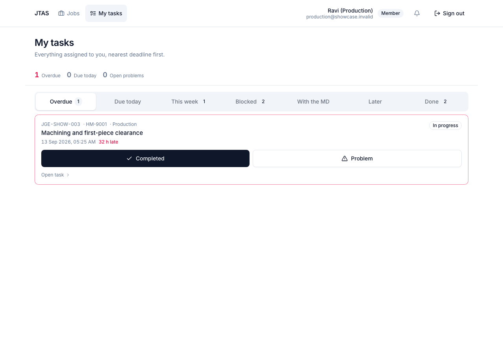
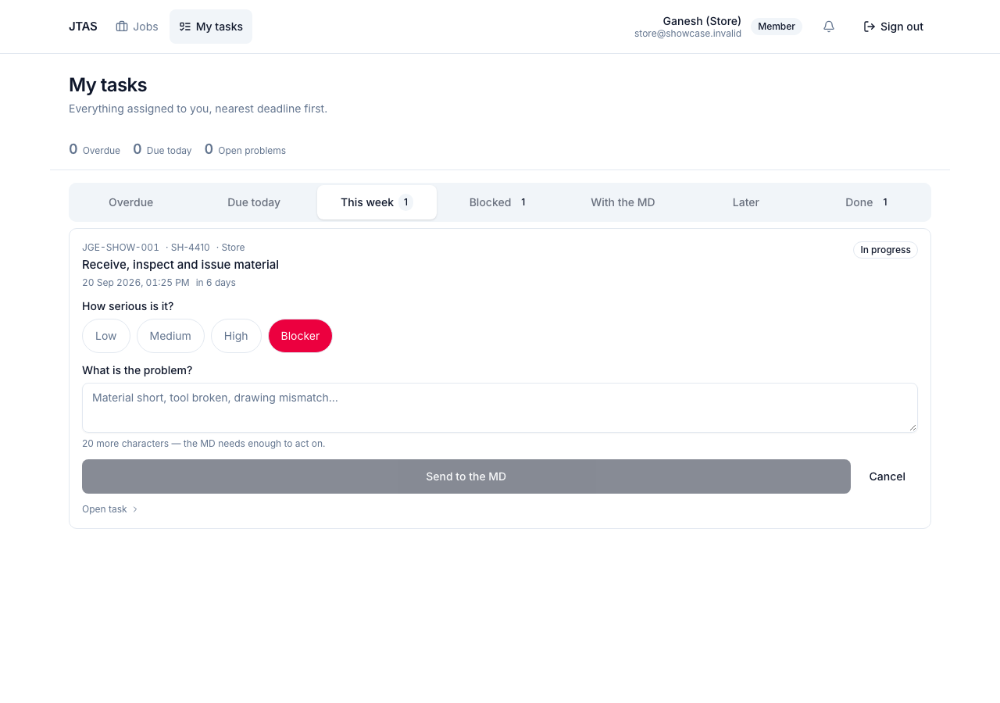

# JTAS — one page for the shop floor

You will get an email when work is assigned to you. Everything you need to do
is on one screen.

**Sign in:** open JTAS on your phone or the shop computer, enter your email and
your password. The first time, it will ask you to choose a new one.

---

## Find your task

Tap **My tasks**. This is the only screen you need.

The tabs across the top sort your work for you:

| Tab | What is in it |
| --- | --- |
| **Overdue** | past its deadline. Start here. |
| **Due today** | finish these today |
| **This week** | coming up |
| **Blocked** | waiting on another department — you cannot start yet |
| **With the MD** | you reported a problem; the MD is deciding |
| **Later** | further out |
| **Done** | finished |

Each card shows the job number, the part number, what has to be done and when
it is due. An overdue card has a red edge and says how late it is.

A **Blocked** card tells you what it is waiting for and who has it. You do not
need to chase them — the system does that. It will move to your list on its own
the moment they finish.

---

## Do the work

Three buttons, and only the ones that make sense are shown.

**Start** — tap it when you actually begin. It tells the MD the work is moving
and stops you being chased for something already underway.

**Completed** — tap it when the work is done. That is the whole thing: no form,
no note required. Finishing your task is what releases the next department, so
do it when it happens rather than at the end of the day.

If your task says **MD approves**, the button says *Send for approval* instead.
The MD gets it, and it is not finished until they accept it.

---

## Report a problem

If something is stopping you — material short, a broken tool, the wrong drawing
— tap **Problem**. Do not just let the deadline pass.

1. **How serious is it?** Tap one.
   - **Low** — annoying, not stopping you
   - **Medium** — will slow this job down
   - **High** — will make it late unless something changes
   - **Blocker** — you cannot do anything at all until it is sorted
2. **What is the problem?** Write at least twenty characters. "Material short
   by twelve bars, supplier has not confirmed a date" is useful. "Problem" is
   not — the MD cannot act on it, and they will only come and ask.
3. Tap **Send to the MD**.

Your task moves to **With the MD** and you stop being chased for it. When they
decide, you will get an email saying what they did, and the task comes back to
your list — often with more time on it.

---

## What gets emailed to you

| When | What it says |
| --- | --- |
| Work is assigned | the job, the task and the deadline |
| Six hours before it is due | a reminder |
| After the deadline passes | that it is late — and the MD is told too |
| The MD decides on your problem | what they decided |
| Your deadline is changed | the new one |

Reminders only arrive during working hours. Overdue mail does not wait.

---

## Questions people ask

**I finished it but tapped the wrong thing.** Tell the MD. They can change it.
Nothing is ever deleted, so it is always fixable.

**Somebody else did my task.** Tell the MD — they can reassign it so the record
matches what actually happened.

**I cannot start; it says Blocked.** Another department has not finished the
step before yours. Open the card to see who. They are already being chased.

**I need more time.** Open the task and ask for an extension. The MD gets it and
decides — do this *before* the deadline, not after.

**I have forgotten my password.** Ask the MD to reset it.
